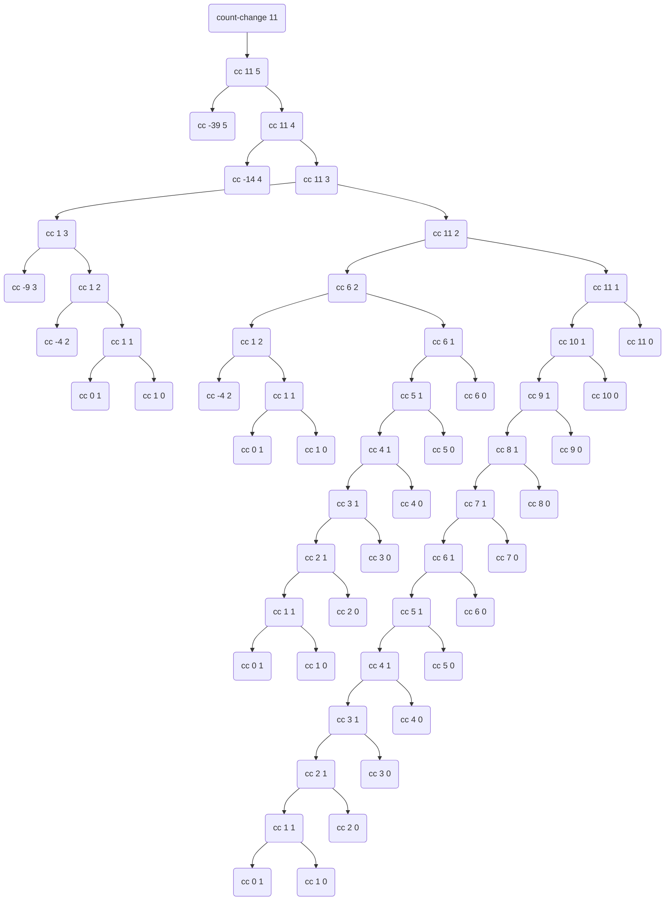

# Exercise 14

(*Subsection 2, Section 2, Chapter 1*)

By runing the code below, the call-stack will be show in the screen.

```scheme
(define (count-change amount) (cc amount 5))

(define (cc amount kinds-of-coins)
    (display "\n-> (cc ")
    (display amount)
    (display " ")
    (display kinds-of-coins)
    (display ")")
    (cond ((= amount 0) 1)
          ((or (< amount 0) (= kinds-of-coins 0)) 0)
          (else (+ (cc amount (- kinds-of-coins 1))
                   (cc (- amount (first-denomination kinds-of-coins))
                       kinds-of-coins)
                )
          )
    )
)

(define (first-denomination kinds-of-coins)
    (cond ((= kinds-of-coins 1) 1)
          ((= kinds-of-coins 2) 5)
          ((= kinds-of-coins 3) 10)
          ((= kinds-of-coins 4) 25)
          ((= kinds-of-coins 5) 50)
    )
)

(count-change 11)
```

Call stack log:

```plain
(count-change 11)
-> (cc 11 5)
-> (cc -39 5)
-> (cc 11 4)
-> (cc -14 4)
-> (cc 11 3)
-> (cc 1 3)
-> (cc -9 3)
-> (cc 1 2)
-> (cc -4 2)
-> (cc 1 1)
-> (cc 0 1)
-> (cc 1 0)
-> (cc 11 2)
-> (cc 6 2)
-> (cc 1 2)
-> (cc -4 2)
-> (cc 1 1)
-> (cc 0 1)
-> (cc 1 0)
-> (cc 6 1)
-> (cc 5 1)
-> (cc 4 1)
-> (cc 3 1)
-> (cc 2 1)
-> (cc 1 1)
-> (cc 0 1)
-> (cc 1 0)
-> (cc 2 0)
-> (cc 3 0)
-> (cc 4 0)
-> (cc 5 0)
-> (cc 6 0)
-> (cc 11 1)
-> (cc 10 1)
-> (cc 9 1)
-> (cc 8 1)
-> (cc 7 1)
-> (cc 6 1)
-> (cc 5 1)
-> (cc 4 1)
-> (cc 3 1)
-> (cc 2 1)
-> (cc 1 1)
-> (cc 0 1)
-> (cc 1 0)
-> (cc 2 0)
-> (cc 3 0)
-> (cc 4 0)
-> (cc 5 0)
-> (cc 6 0)
-> (cc 7 0)
-> (cc 8 0)
-> (cc 9 0)
-> (cc 10 0)
-> (cc 11 0)
```

The flow is like this way:



## The Orders of Growth of the Space and Number of steps

Simplely it's O(n^m), where the m is equal to the kinds-of-coins, which in this
case it's 5. Because for each N it will be devided into 5 parts, as the
defination of the function `cc`. For Example, for any N used in `cash-change`,
it will call `cc N 5`, `cc N 4`, `cc N 3`, `cc N 2` and `cc N 1`. and for each
part it will call itself again reducely. The `cc N 1` section is O(N), so the
`cc N 2` will be T(N) = N * O(N) = O(N^2), and so on.
